# CEPARCO SIMD Programming Project
#### AMBROSIO, ARCETA, MENDOZA, TAN
**Input**: Memory location n (integer) contains the length of the vector; Vectors X and Y are both **32-bit integer**. 

**Process**: Y[i] = X[i - 3] + X[i - 2] + X[i - 1] + X[i] + X[i + 1] + X[i + 2]  + X[i + 3] 

**Output**: store result in vector Y. Also, display the result of first ten elements and last 10 elements of vector Y for all versions of kernels.

*Example: X-> 1.2.3.4.5.6.7.8: output: Y-> 28.35*

## Implementation
This project involves implementing the 1D stencil kernel in C, x86-64 assembly, and SIMD AVX2 with XMM and YMM registers. Outputs from the x86-64 assembly and SIMD AVX2 implementations are compared with a C computed result to confirm the correctness, and the last and first 10 elements of the output vectors are printed for verification. The kernel implementations are tested with vector sizes 2^20, 2^26, and 2^30, however to account for boundary situations, all runs are instead tested with vector sizes 2^20 + 7, 2^26 + 7, and 2^30 + 7, since for the given data type, the XMM and YMM registers can hold 4 and 8 values respectively, thus using 7 as a boundary condition properly checks both cases. The input vector is randomized using the C standard library rand() function.

```
time_t t;
srand((unsigned int)time(&t));
for (i = 0; i < ARRAY_SIZE; i++)
	x[i] = (int32_t)rand();
```
Randomness was implemented using the above code snippet to provide the x input vector with random values.

### C
#### Code
```
void c_1D_stencil(size_t ARRAY_SIZE, int32_t* x, int32_t* y) {
    size_t i;
    for (i = 3; i < ARRAY_SIZE - 3; i++) {
        y[i - 3] = x[i - 3] + x[i - 2] + x[i - 1] + x[i] + x[i + 1] + x[i + 2] + x[i + 3];
    }
}
```
This implementation serves as the baseline for comparison. It gets the sum of the 7-element window centered at each element of the x vector. The y vector indexing is offset by 3 on both sides to account for the fact that the stencil outputs exactly 6 elements less than the input vector due to the window size. Thus this enables exact output size and no empty elements in the vector.

#### Screenshots
##### C Output at 2^20 (Debug)
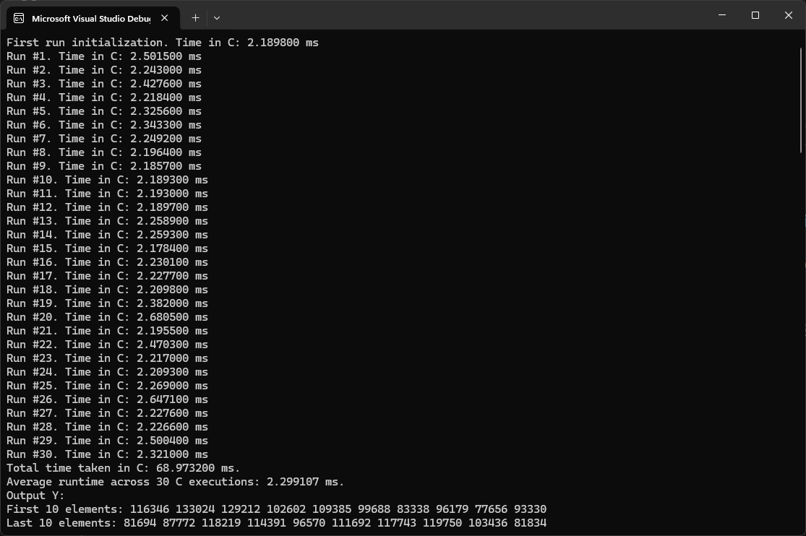
##### C Output at 2^20 (Release)

##### C Output at 2^26 (Debug)
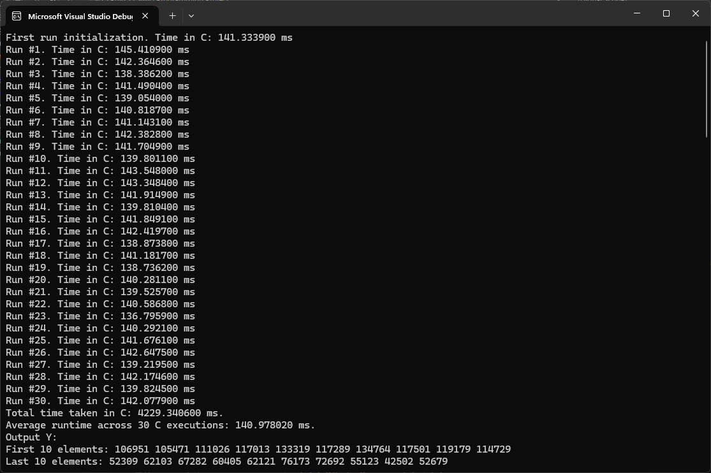
##### C Output at 2^26 (Release)
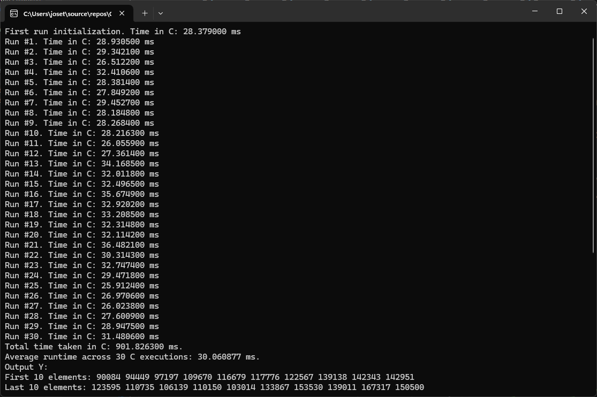
##### C Output at 2^30 (Debug)
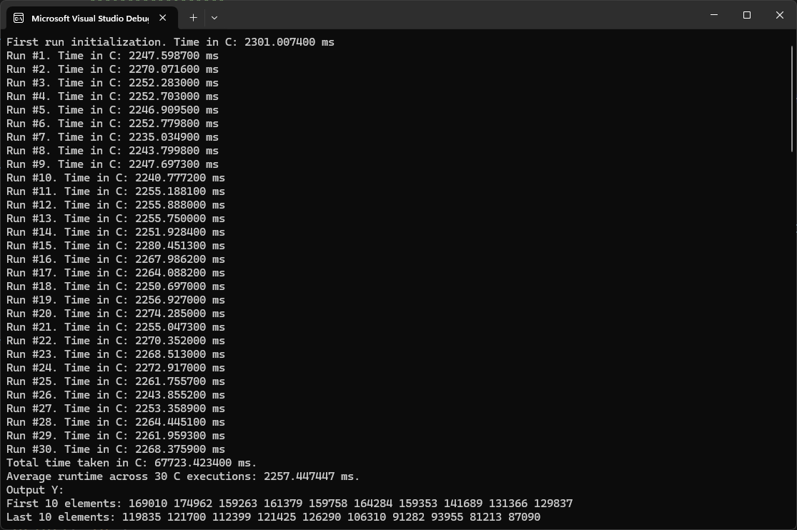
##### C Output at 2^30 (Release)
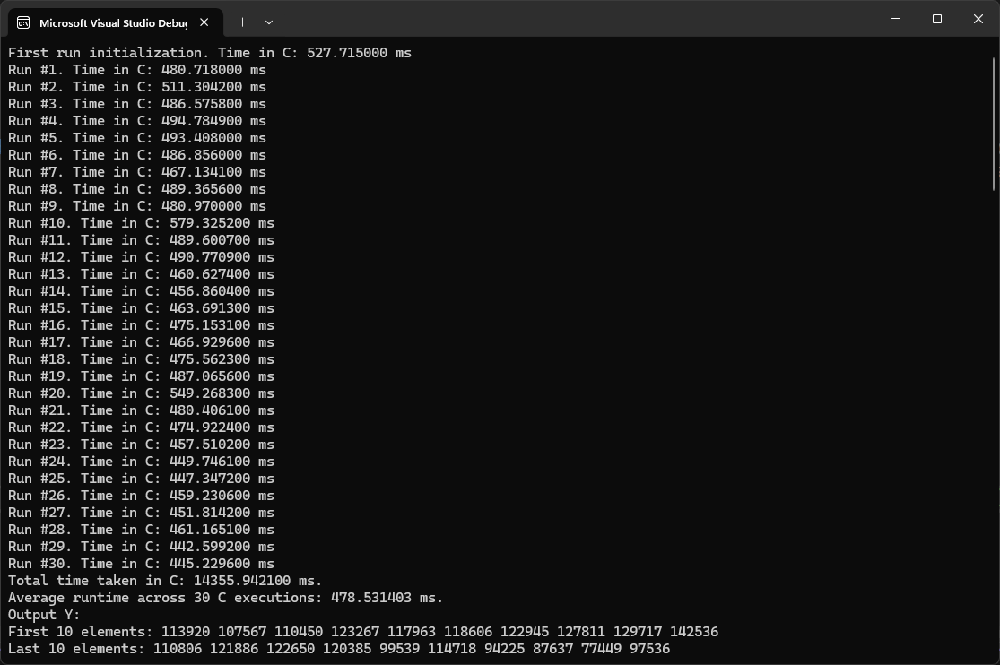

### x86-64 ASM
#### Code
```
asm_1D_stencil:
	mov r10, rcx
	sub r10, 1
L1:
	xor rax, rax
	mov rcx, 7
	L2: 
		add rax, [rdx]
		add rdx, 4
		loop L2

	sub rdx, 24
	mov [r8], rax
	add r8, 4
	dec r10
	cmp r10, 0
	jnz L1

	xor rax, rax
	ret
```
This implementation utilized a nested loop to achieve the stencil operation. the inner loop accumulated the value of the current value being calculated, and the 7 consecutive values are iterated through and added to an accumulator, after which the value is stored to the array. The pointers of the input and output vectors are adjusted accordingly between iterations to ensure that the correct values from the input vector are being accumulated and that the resulting sums are stored in the correct location in the output vector.

#### Screenshots
##### x86-64 ASM Output at 2^20 (Debug)

##### x86-64 ASM Output at 2^20 (Release)
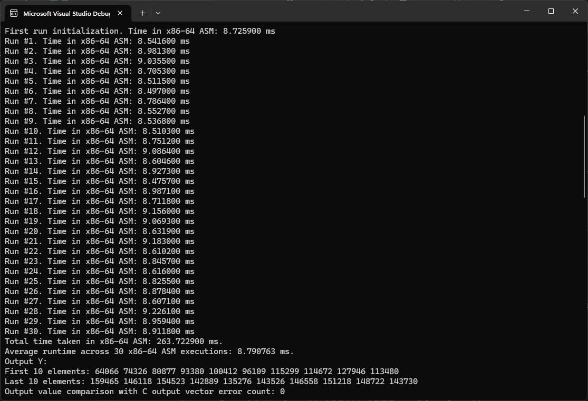
##### x86-64 ASM Output at 2^26 (Debug)
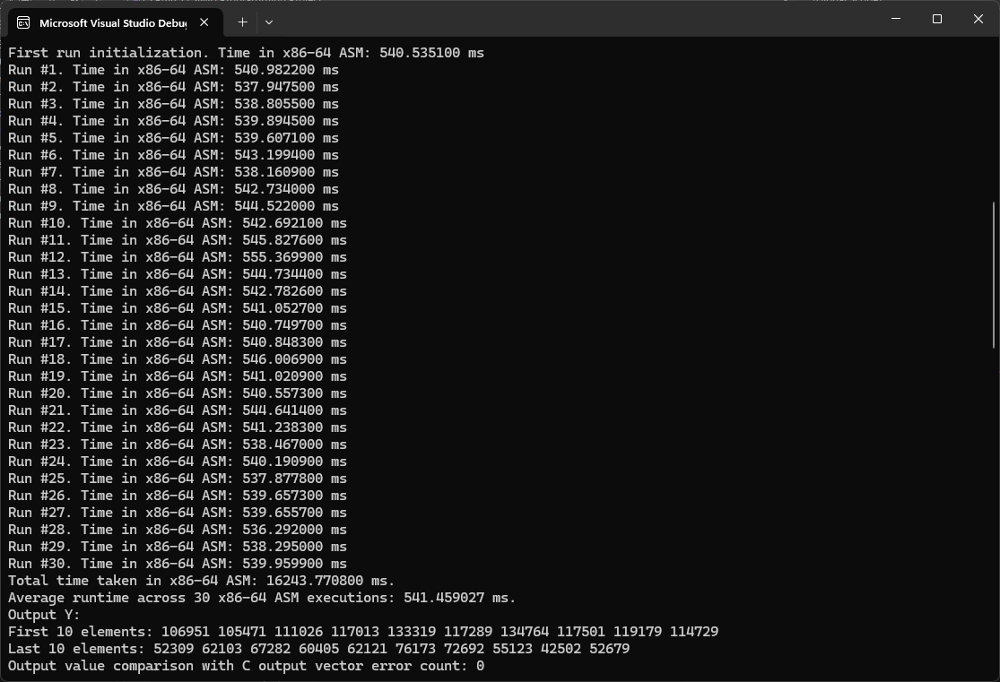
##### x86-64 ASM Output at 2^26 (Release)
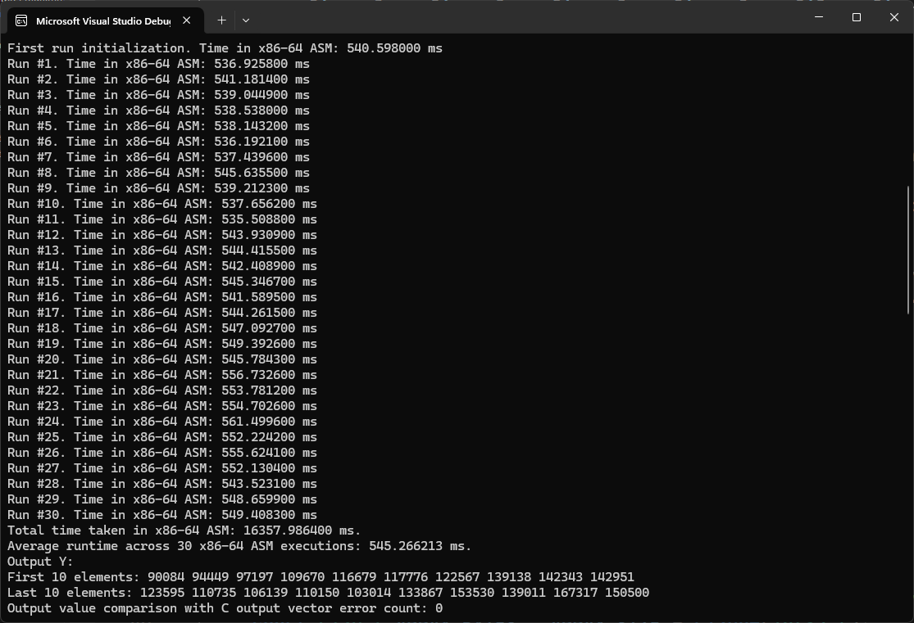
##### x86-64 ASM Output at 2^30 (Debug)
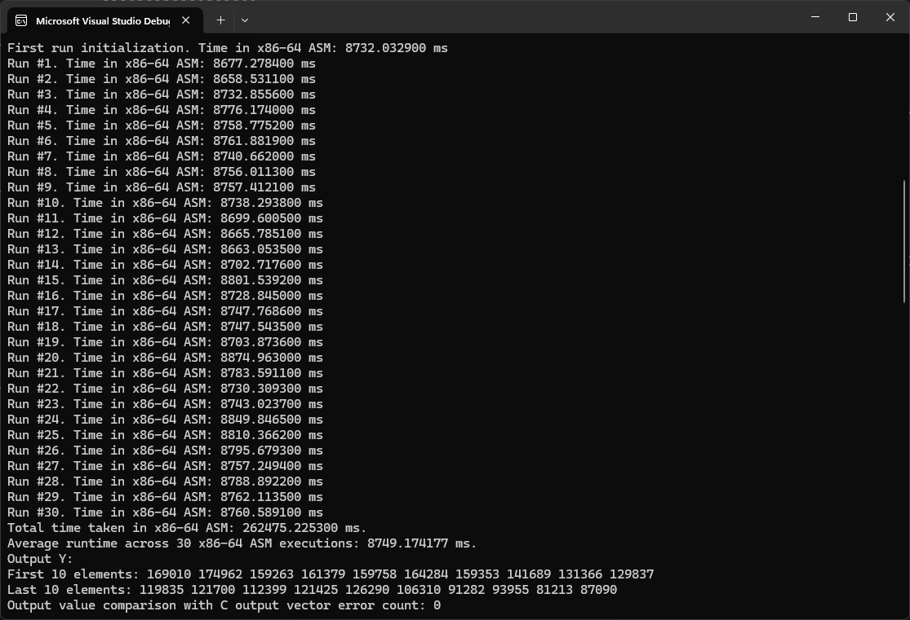
##### x86-64 ASM Output at 2^30 (Release)


### x86 SIMD AVX2 ASM using XMM
#### Code
```
xmm_1D_stencil:
	push rbx
	push rsi
	push rdi
	sub rsp,0x10
	movdqu [rsp],xmm6

	sub rcx, 0x0000_0000_0000_0004
	xor rsi, rsi
	xmmloop1:
		movdqu xmm0, [rdx+rsi*4]
		movdqu xmm1, [rdx+rsi*4+4]
		movdqu xmm2, [rdx+rsi*4+8]
		movdqu xmm3, [rdx+rsi*4+12]
		movdqu xmm4, [rdx+rsi*4+16]
		movdqu xmm5, [rdx+rsi*4+20]
		movdqu xmm6, [rdx+rsi*4+24]
		paddd xmm0, xmm1
		paddd xmm2, xmm3
		paddd xmm4, xmm5
		paddd xmm0, xmm6
		paddd xmm2, xmm4
		paddd xmm0, xmm2
		movdqu [R8+rsi*4], xmm0
		add rsi, 0x0000_0000_0000_0003
		sub rcx, 0x0000_0000_0000_0003
		cmp rcx, 0x0
		jg xmmloop1

	add ECX, 0x0000_0000_0000_0003
	mov R11, 7

	xmmloop2:
		xor RBX,RBX
		mov R10, R11
		xmmloop3:
			xor RAX,RAX
			mov RAX, [RDX+RSI*4]
			add RBX,RAX
			inc rsi
			dec R10
			cmp R10, 0x0
			jg xmmloop3
		sub RSI, R11
		mov [R8+RSI*4], RBX
		inc RSI
		loop xmmloop2


	movdqu xmm6,[rsp]
	add rsp,0x10
	pop rdi
	pop rsi
	pop rbx
	xor rax, rax
	ret
```

This implementation uses XMM registers to perform SIMD operations and utilizes the paddd instruction, which operates on 4 packed integers, allowing for parallel processing of 4 elements. 7 registers are used to get the seven input elements required for the stencil operation. Push and pop are used to preserve the values of the non-volatile registers such as xmm6, rbx, rsi, rsp, and rdi used in this code. It will prevent unexpected values and behavior that can cause an issue to the program. Although theoretically, it'll work on 4 integers at a time, due to the possibility of a violationError, in which the program accesses memory that has not been allocated, it was changed such that it will only work on 3 integers at a time, this makes it slightly more inefficient than ideal. Another obstacle was that due to making it such that it only works on 3 integers at a time, there were always some elements that do not get solved for. To rectify this, we used the serial asm x86-64 implementation to solve for the last couple elements, this is slightly inefficient but also ensures that no violationError occurs. As an example of the violationError, if we were on the last loop with only 3 elements left, the last packed integer of the last register would be the 16 bytes after the end of the allocated memory for the input array.

#### Screenshots
##### x86 SIMD AVX2 using XMM Output at 2^20 (Debug)
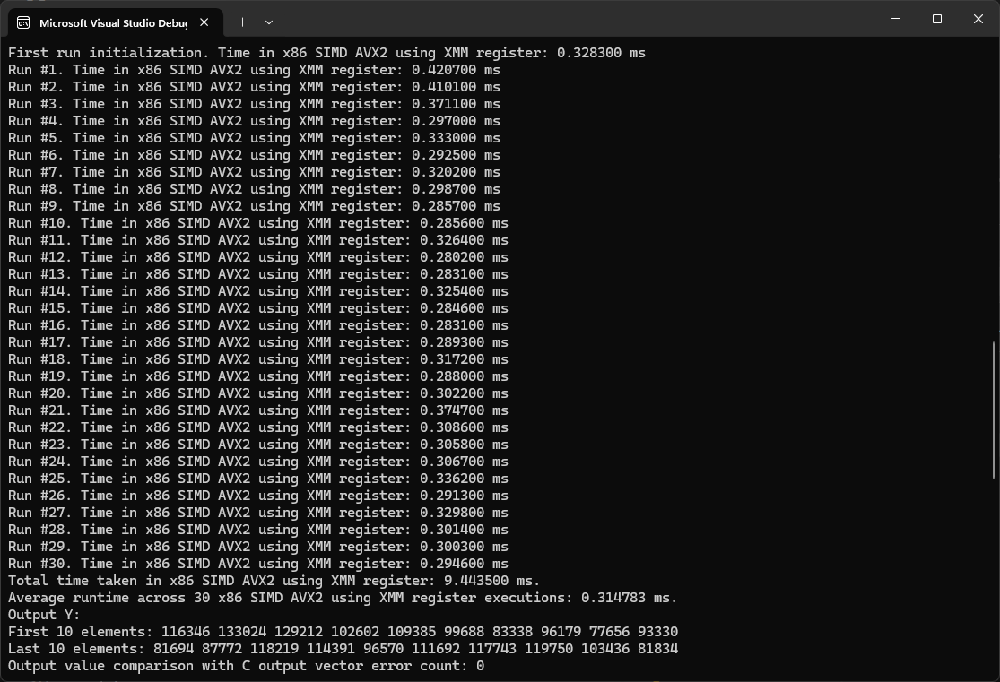
##### x86 SIMD AVX2 using XMM Output at 2^20 (Release)

##### x86 SIMD AVX2 using XMM Output at 2^26 (Debug)
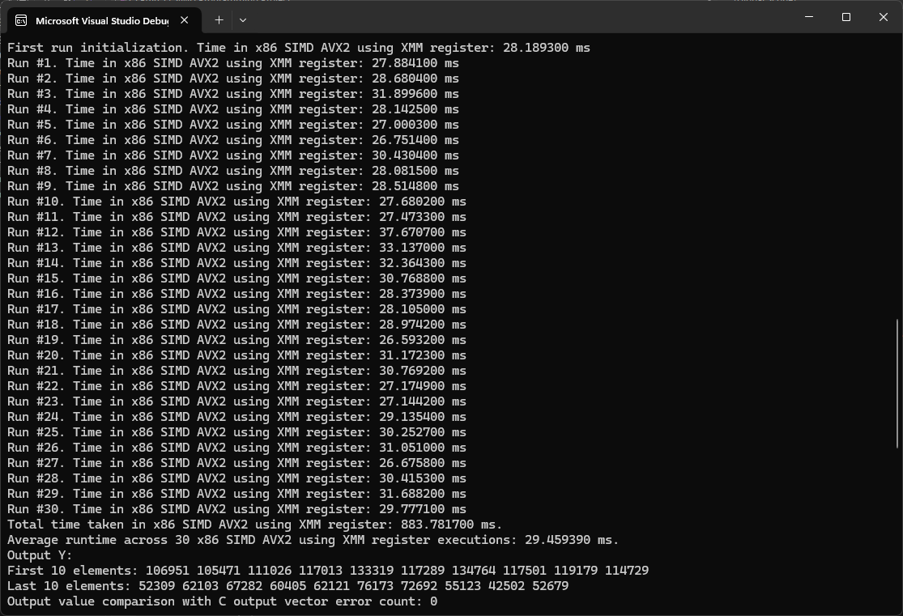
##### x86 SIMD AVX2 using XMM Output at 2^26 (Release)
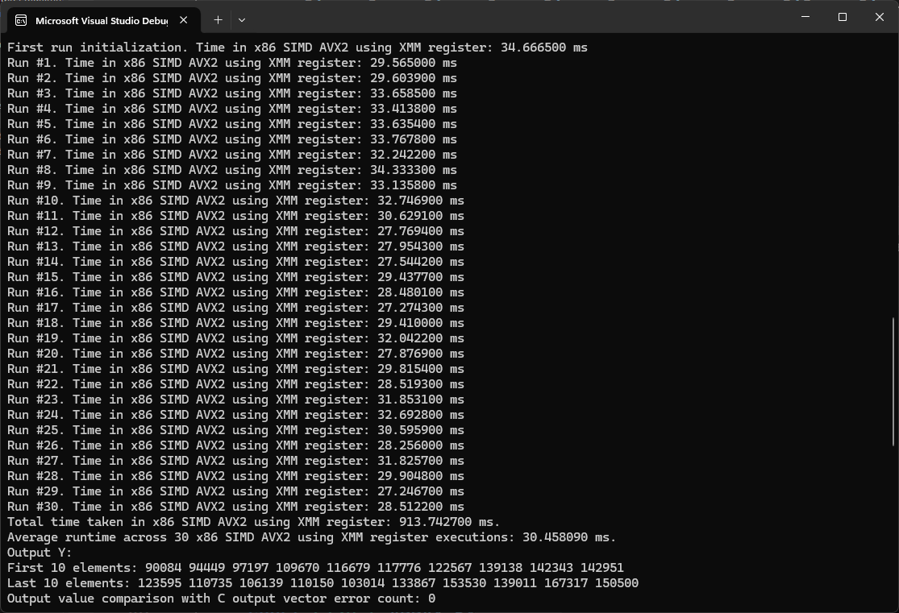
##### x86 SIMD AVX2 using XMM Output at 2^30 (Debug)
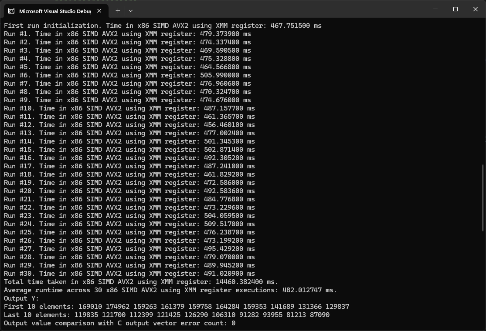
##### x86 SIMD AVX2 using XMM Output at 2^30 (Release)
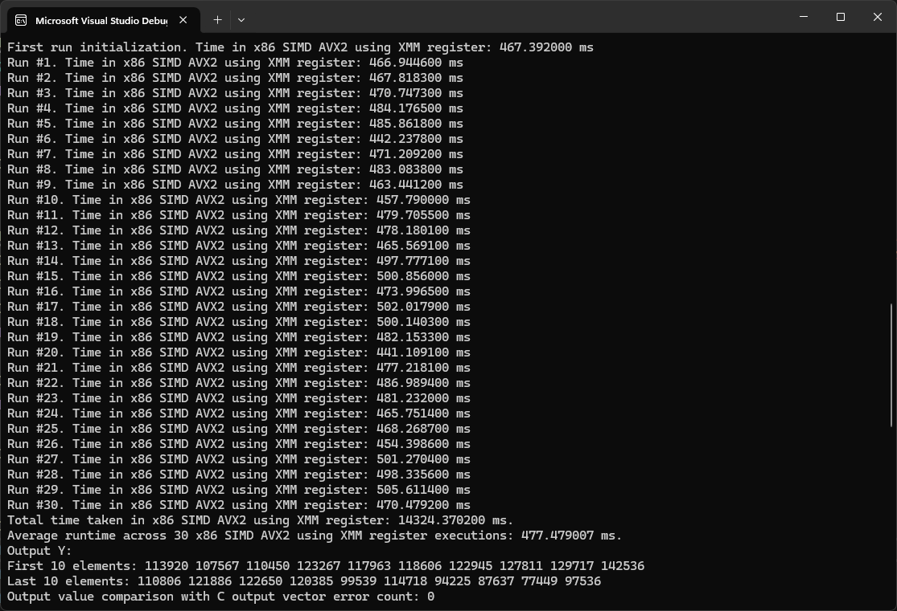

### x86 SIMD AVX2 ASM using YMM
#### Code
```
ymm_1D_stencil:
	push rbx
	push rsi
	push rdi
	sub rsp,0x20
	vmovdqu [rsp],ymm6
	sub rsp,0x20
	vmovdqu [rsp],ymm7
	sub rsp,0x20
	vmovdqu [rsp],ymm8
	sub rsp,0x20
	vmovdqu [rsp],ymm9
	sub rsp,0x20
	vmovdqu [rsp],ymm10
	sub rsp,0x20
	vmovdqu [rsp],ymm11
	sub rsp,0x20
	vmovdqu [rsp],ymm12

	sub rcx, 0x0000_0000_0000_0008
	xor rsi, rsi
	ymmloop1:
		vmovdqu ymm0, [rdx+rsi*4]
		vmovdqu ymm1, [rdx+rsi*4+4]
		vmovdqu ymm2, [rdx+rsi*4+8]
		vmovdqu ymm3, [rdx+rsi*4+12]
		vmovdqu ymm4, [rdx+rsi*4+16]
		vmovdqu ymm5, [rdx+rsi*4+20]
		vmovdqu ymm6, [rdx+rsi*4+24]
		vpaddd ymm7, ymm0, ymm1
		vpaddd ymm8, ymm2, ymm3
		vpaddd ymm9, ymm4,ymm5
		vpaddd ymm13, ymm7, ymm6
		vpaddd ymm11, ymm8, ymm9
		vpaddd ymm12, ymm13, ymm11
		vmovdqu [R8+rsi*4], ymm12
		add rsi, 0x0000_0000_0000_0007
		sub rcx, 0x0000_0000_0000_0007
		cmp rcx, 0x0
		jg ymmloop1
	
	add ECX, 0x0000_0000_0000_0007
	mov R11, 7

	ymmloop2:
		xor RBX,RBX
		mov R10, R11
		ymmloop3:
			xor RAX,RAX
			mov RAX, [RDX+RSI*4]
			add RBX,RAX
			inc rsi
			dec R10
			cmp R10, 0x0
			jg ymmloop3
		sub RSI, R11
		mov [R8+RSI*4], RBX
		inc RSI
		loop ymmloop2


	vmovdqu ymm12,[rsp]
	add rsp,0x20
	vmovdqu ymm11,[rsp]
	add rsp,0x20
	vmovdqu ymm10,[rsp]
	add rsp,0x20
	vmovdqu ymm9,[rsp]
	add rsp,0x20
	vmovdqu ymm8,[rsp]
	add rsp,0x20
	vmovdqu ymm7,[rsp]
	add rsp,0x20
	vmovdqu ymm6,[rsp]
	add rsp,0x20
	pop rdi
	pop rsi
	pop rbx

	xor rax, rax
	ret
```

This version uses YMM registers (256-bit) for SIMD operations. vpaddd instruction operates on 8 packed integers, doubling the parallelism compared to the XMM implementation. All in all, 13 registers are used in this code. 7 registers are used to get the seven input elements required for the stencil operation, and the other 6 registers are used for the vpaddd instructions for adding the input elements. Push and pop are used to preserve the values of the non-volatile registers such as ymm5-ymm13, rbx, rsi, rsp, and rdi used in this code. It will prevent unexpected values and behavior that can cause an issue to the program. Although theoretically, it'll work on 8 integers at a time, due to the possibility of a violationError, in which the program accesses memory that has not been allocated, it was changed such that it will only work on 7 integers at a time, this makes it slightly more inefficient than ideal. Another obstacle was that due to making it such that it only works on 7 integers at a time, some elements always do not get solved for. To rectify this, we used the serial asm x86-64 implementation to solve for the last couple elements, this is slightly inefficient but also ensures that no violationError occurs. As an example of the violationError, if we were on the last loop with only 7 elements left, the last packed integer of the last register would be the 32 bytes after the end of the allocated memory for the input array.


#### Screenshots
##### x86 SIMD AVX2 using YMM Output at 2^20 (Debug)
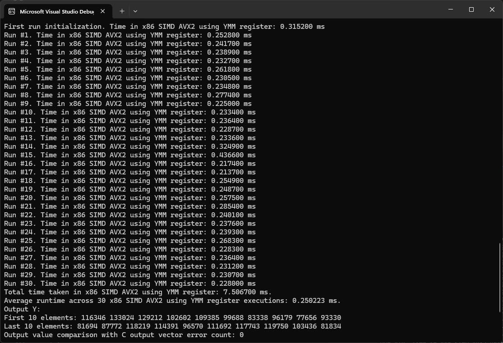
##### x86 SIMD AVX2 using YMM Output at 2^20 (Release)

##### x86 SIMD AVX2 using YMM Output at 2^26 (Debug)
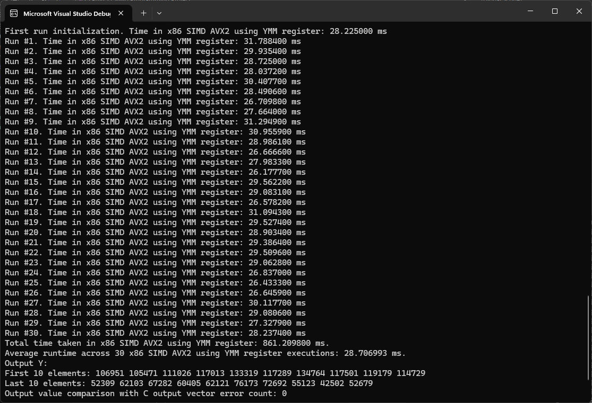
##### x86 SIMD AVX2 using YMM Output at 2^26 (Release)
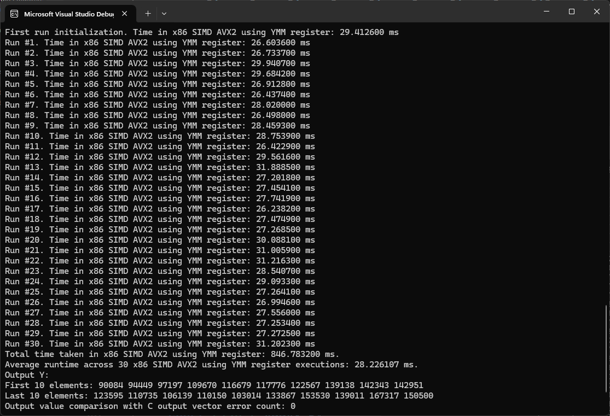
##### x86 SIMD AVX2 using YMM Output at 2^30 (Debug)
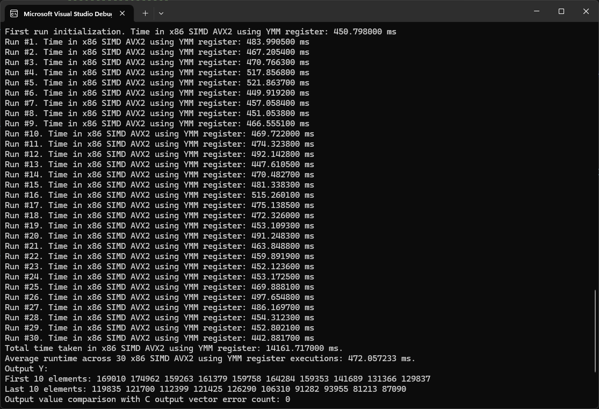
##### x86 SIMD AVX2 using YMM Output at 2^30 (Release)
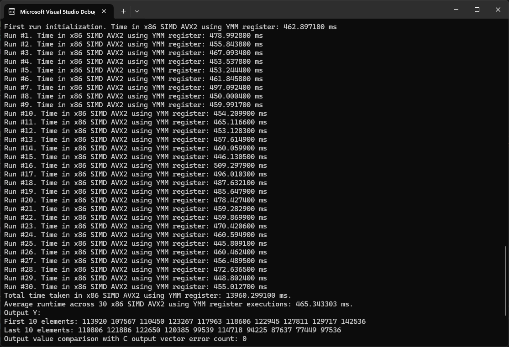

## Table of Execution Time
Execution times for each implementation are measured in both DEBUG and RELEASE mode. The kernel is ran 30 times and the average runtime is calculated. A single run is also executed as a buffer to eliminate the first run performance outlier. Below are the tables of average runtime of each implementation in Debug and Release modes.


| _**Debug Mode**_ | 2^20 | 2^26 | 2^30 |
| ------------- |-------------|------------- |------------- |
| C | 2.299107 ms | 140.978020 ms | 2257.447447 ms |
| x86-64 ASM | 8.670397 ms | 541.459027 ms | 8749.174177 ms |
| x86 SIMD AVX2 ASM using XMM | 0.314783 ms | 29.459390 ms | 482.012747 ms |
| x86 SIMD AVX2 ASM using YMM | 0.250223 ms | 28.706993 ms | 472.057233 ms |


| _**Release Mode**_ | 2^20 | 2^26 | 2^30 |
| ------------- |-------------|------------- |------------- |
| C | 0.381130 ms | 30.060877 ms | 478.531403 ms |
| x86-64 ASM | 8.790763 ms | 545.266213 ms | 8722.438213 ms |
| x86 SIMD AVX2 ASM using XMM | 0.334360 ms | 30.458090 ms | 477.479007 ms |
| x86 SIMD AVX2 ASM using YMM | 0.270087 ms | 28.226107 ms | 465.343303 ms |

## Performance Analysis
As can be seen from the tables above, the YMM register AVX2 ASM performed the best, with XMM register AVX2 ASM performing slightly behind. This is followed closely by C in release mode, then C in debug mode being moderately further behind, and lastly x86-64 ASM performing significantly slower than the rest. It is important to note that DEBUG/RELEASE mode only affects the C kernel implementation, and thus the repeated runs for the assembly implementations can simply be looked at as more data to draw conclusions from. Thus, we also learn from these values that there is a significant amount of experimental difference between multiple runs of the same configurations, likely due to the input array sizes being significantly large. Thus it can be said that 30 executions is not nearly enough to expertly conclude precise differences in performance due to the fluctations, especially with some of the gaps going anywhere from 2-22% for XMM vs YMM AVX2, among others. 

Regardless, we can generally say that YMM AVX2 ASM implementation is able to perform consistently the best, with XMM AVX2 ASM and Release Mode C close behind and perform competitvely with each other, with edge cases allowing C Release Mode to perform better. With these relatively close in performance, the next would be the unoptimized C Debug Mode, being 300-500% slower than the initial cluster of best performing implementations (C Release, YMM AVX2, XMM AVX2). Last is the x86-64 ASM implementation, being around 280% slower than C in Debug Mode. This brings the total performance gap between YMM AVX2 and x86-64 ASM to hover around 3000%.

The easiest to take a look at would be the x86-64 ASM implementation and understand why it performed significantly worse than the rest. The serial implementation in this project as mentioned above utilized a nested loop to compute the stencil values. While the stencil window is only of size 7, a complexity of O(7n) is still expected to be bigger than a single loop implementation such as the C (and even the AVX2 implementations, who themselves have further optimizations). While not equivalent due to the differences in c calls, this provides some insight which is reflected in the execution times observed.

Both the AVX2 implementations utilize the SIMD paradigm to accelerate the executions by operating on more than one value; in this case 4 and 8 respectively. Due to the violationError considerations made, the implementations in practice operate on 3 and 7 new unique values instead. while this gives the impression that there is an over 2.33x hypothetical performance gain, our results show otherwise, leading us to speculate how an implementation that operates 3 new values per iteration can perform close to an implementation that operates 7 new values. In terms of implementation, it can be speculated that since the V instructions (VPADDD vs PADDD, etc.) interacts with 3 registers compared to 2, among other reasons, results in each instruction to execute slower. Some other external bottlenecks may be the following: cache memory, differing CPU microarchitectures (the XMMM vs YMM gap varied between systems tested).

The improvement of C when optimized in Release Mode vs when unoptimized in Debug Mode is also interesting to see, as the compiler is able to use optimizations invisible to the user which allows the code to compete with SIMD AVX2 implementations in performance.

Overall, **the SIMD AVX2 with YMM implementation is the fastest and most efficient among the 4 implementations, with the SIMD AVX2 with XMM implementation close behind**. The YMM implementation takes full advantage of AVX2 instructions and 256-bit registers to improve performance significantly over C and x86-64 assembly versions, with the XMM implementation's utilization of AVX2 and 128-bit registers allowing it to compete. The results clearly show the effectiveness of SIMD parallelism in optimizing computationally expensive operations. 

## Additional Discussion
Non-volatile registers (such as rbx, rsi, rdi, rsp, ymm5-ymm13, etc.) retain their values across function boundaries. Therefore, preserving their original value via push and pop is important. Pushing these registers onto the stack before using them within a function ensures the original values are preserved for the calling function when the function returns. The inability to retain the non-volatile's original value may lead to unexpected behavior when the function returns. In our case, the code was operating in debug mode but was broken in release mode.
